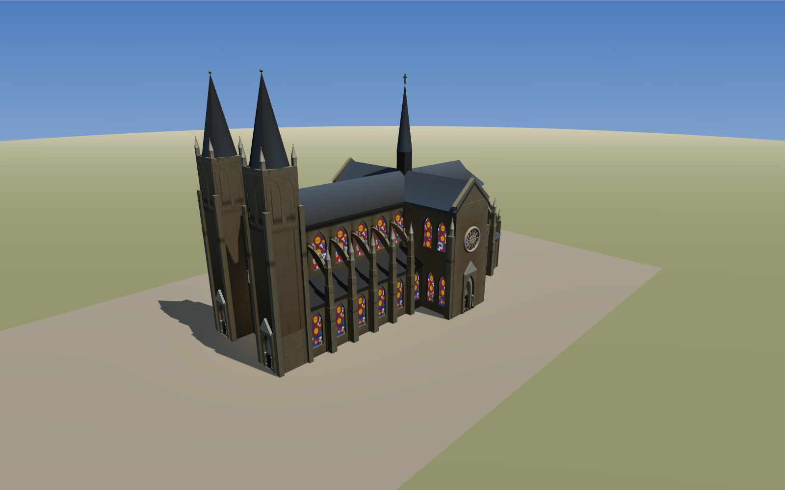

# 石头与光 · 程序化哥特大教堂

**在线体验：https://church.bigcow.net**（备用镜像：https://zhuguangjun2002.github.io/stone-and-light/）

用 Three.js 程序化生成的一座盛期哥特风格大教堂，可以在浏览器里自由漫游。
没有任何外部模型资源——每一块"石头"都是按真实大教堂的结构逻辑用代码砌出来的。

> **EN** — *Stone & Light* is a fully procedural High Gothic cathedral in vanilla Three.js:
> pointed arches, quadripartite rib vaults, flying buttresses, procedural stained glass,
> a construction-sequence animation with medieval site equipment, a cinematic guided tour,
> day/night lighting, synthesized bells, and parametric presets of Notre-Dame, Chartres,
> Amiens & Cologne. No external 3D assets — every stone is code.
> **Live demo:** https://church.bigcow.net



## 运行

```bash
cd church
python3 -m http.server 8123
# 打开 http://localhost:8123/
```

（任何静态文件服务器都可以；ES Module 不能直接用 file:// 打开。）

## 操作

| 按键 | 功能 |
|---|---|
| 拖动 / 滚轮 / 右键拖 | 环视 / 远近 / 平移 |
| `1`–`7` | 视角书签：全景 / 西立面 / 中厅 / 拱顶 / 飞扶壁 / 后殿 / 管风琴楼廊 |
| `O` | 管风琴：西端楼廊上的琴（玫瑰窗之下、大门之上），奏巴赫《d 小调托卡塔与赋格》BWV 565 开头——公版乐谱、Web Audio 加法合成主音管音色，过教堂混响 |
| `T` | 电影导览：十个镜头约两分半的自动巡游，字幕解说，含剖面镜头与建造蒙太奇，黄昏收尾（`→` 跳下一镜头，`Esc` 退出） |
| `B` | 建造过程动画：按真实施工顺序自东向西、自下而上生长，时间轴可播放 / 拖动；脚手架与大车轮吊车跟随施工前沿，完工鸣钟 |
| `F` | 第一人称行走：点击画面锁定鼠标，WASD 移动，Shift 加速，再按 `F` 返回环视 |
| `P` | 设计与光面板：名堂预设（巴黎圣母院 / 沙特尔 / 亚眠 / 科隆，选中弹出年代、数据与故事的解说卡片）；时刻滑块（太阳自东向西，晨昏光色）；**镶玻方案**（沙特尔式 / 晚期银黄，换完自动重烘室内光照）；开间数 / 起拱高 / 尖拱曲率 / 塔高，改动即重建整座教堂 |
| `G` / `M` | 敲一记钟 / 静音（钟声为 Web Audio 非谐泛音合成；室外有风与鸟，入堂自动安静） |
| `C` | 剖面切换：完整 → 横剖 → 纵剖 |
| `L` | 结构标注：固定屏幕尺寸，随相机在室内 / 室外自动切换两组，屏幕上压盖的标签近处优先、自动避让 |
| `H` | 收起帮助 |

URL 参数：`?view=3&section=1&labels=1&build=0.42&time=0.95&panel=1&tour=1&preset=cologne`

## 代码即结构：模块与建筑构件的对应

| 模块 | 建筑构件 | 结构原理 |
|---|---|---|
| `src/gothic.js` | 尖拱、束柱、山墙、小尖塔 | 尖拱可在同一高度适配任意跨度，是整套体系的几何自由度来源 |
| `src/vault.js` | 四分肋拱顶 | 蹼面取两个尖筒拱的相贯面 `y = max(纵拱, 横拱)`；不同跨度靠 `kForApex()` 调曲率拱到同一顶高 |
| `src/buttress.js` | 飞扶壁 = 扶壁墩 + 飞券 + 小尖塔 | 把拱顶的水平推力接力到侧廊之外，高墙才能开窗 |
| `src/glass.js` | 柳叶窗与玫瑰窗的彩色玻璃 | Canvas 程序化铅条镶嵌；两套镶玻方案（`GLAZING`）差在图案密度与**透光率**；不发光材质模拟"窗自体发光"的哥特室内观感 |
| `src/bake.js` / `src/grid.js` / `src/bakeworker.js` | 室内光照烘焙 | 静态的光离线算、运行时只查表——游戏里 lightmap 的做法（见下） |
| `src/facade.js` | 西立面：双塔、三门廊、玫瑰窗、国王廊 | 平面（中厅+双侧廊）直接投影为立面上的三座门；三座门都通到室内——塔身底层是可穿行的开间，侧门穿塔底进侧廊 |
| `src/cathedral.js` | 总装：拉丁十字平面、三段式立面、屋面 | 逐开间（bay）装配——中世纪工地也是这样一跨一跨盖的 |
| `src/materials.js` | 全部材质与程序化贴图 | 石缝、棋盘铺地、木门都用 Canvas 现画，无外部图片；贴图统一开各向异性过滤 |
| `src/params.js` | 全部尺寸 | 基础参数 + `recomputeDerived()`；设计面板改的就是这里 |
| `src/presets.js` | 名堂预设 | 用参数近似圣母院（平顶塔）、沙特尔（不对称塔）、亚眠（最高拱顶）、科隆（巨塔）——同一套结构语言，各城各唱各的调 |
| `src/tour.js` | 电影导览脚本 | 十个镜头的推轨路径与字幕，含剖面镜头、建造蒙太奇、黄昏尾声 |
| `src/worksite.js` | 工地装备 | 脚手架（LineSegments 格架）、大车轮踏轮吊车、石料堆，跟随建造前沿移动 |
| `src/audio.js` | 声音 | 钟声按真实钟的非谐泛音列（hum/prime/tierce…）合成；风、鸟、入堂圣咏垫，全部 Web Audio 无音频文件 |
| `src/main.js` | 光照日夜、漫游 / 行走、剖面、标注、建造动画、设计面板 | 建造次序 = 区域（歌坛→耳堂→中厅逐开间→西立面→尖塔）+ 区域内自下而上；剖面用材质级裁剪；标注按室内 / 外分组并做屏幕空间去重 |

## 导览影片

[docs/tour.mp4](docs/tour.mp4) 是导览的成片（1280×720 / 24fps / 约 2 分 18 秒）。
重新渲染：页面以 `?record=1` 打开时进入确定性逐帧模式（`window.__tourStep(dt)`），
`tools/record-tour.mjs` 用 puppeteer 抓帧后由 ffmpeg 合成：

```bash
python3 -m http.server 8123 &
mkdir -p rec/frames && cd rec && npm i puppeteer-core
node ../tools/record-tour.mjs
ffmpeg -framerate 24 -i frames/f%05d.jpg -c:v libx264 -pix_fmt yuv420p -crf 21 tour.mp4
```

## 测试与检查

```bash
node test/smoke.mjs          # 无浏览器构建整个场景图，校验网格数与总高
node tools/check-zfight.mjs  # 静态查 z-fighting：共面重叠（见下）
node tools/check-flicker.mjs # 动态查闪烁：真渲染 + 微扰对比，能定位到具体网格（见下）
node tools/check-rain.mjs    # 下雨天哪里漏：撒一场雨，找出雨能钻进室内的口子（见下）
node tools/check-poke.mjs    # 查"露出来的部分"：构件的一角戳穿了屋面/墙面（见下）
# test/audio-render.html     # 浏览器打开：离线渲染音频，测量钟声/管风琴的峰值与 RMS
```

### z-fighting 检查器

`tools/check-zfight.mjs` 在 node 里建出整座教堂，把全部三角形转成世界坐标后按支撑
平面分桶，找出**几乎共面 + 投影有重叠 + 法线同向**的面对——这类面深度值几乎相同，
谁被画出来由视角和浮点误差决定，走动时就会闪。用 Sutherland–Hodgman 裁剪算真实
重叠面积，再从重叠处朝法线半球打射线做可见性判定（先撞到背面 = 出发点在实体内部；
正对法线的射线走不出去 = 被挡住），把"埋在墙里所以不会闪"的那一大半滤掉。

```bash
node tools/check-zfight.mjs [最大间距m] [最小重叠m²]   # 默认 0.06 / 0.20
TOP=40 node tools/check-zfight.mjs 0.004 0.2           # 只看严格共面的，列前 40 条
```

当前基线：**严格共面（间距 ≤4 mm）、≥0.2 m² 的重叠 0 处**。0.2 m² 以下还有一条
长尾，是肋券交叉、墙体转角相接这类构件真实相交处的碎三角形，属于几何相交本身，
不做 CSG 消不掉。（放宽到默认的 6 cm 会报出两百多处，那些是按几何约定故意留出的
几厘米搭接量，不是打架。）

### 闪烁检查器（动态，会定位到具体网格）

静态检查器只认"共面重叠"这一种成因，管不了曲面相切、也管不了剖面。
`tools/check-flicker.mjs` 换一条路：用 headless Chrome（SwiftShader 软渲染，不需要
显卡）真渲染一帧，再渲染几帧**微扰帧**，逐像素比对——同一个像素两帧不一样，就说明
它的归属是靠浮点误差决定的，也就是屏幕上会闪的地方。三种微扰各自对应一种成因：

| 微扰 | 屏幕上动了什么 | 变了说明 |
|---|---|---|
| 近裁剪面 ×1.0002 | 什么都没动，只改深度量化 | **z-fighting**：两个面深度几乎相同 |
| 剖切面挪 4 mm | 什么都没动，只挪裁剪判据 | **面正好躺在剖切面上**：裁剪判据恒为 0，逐像素抖 |
| 相机挪 1 mm | 亚像素级移动 | 其余不稳定（透明体排序跳变等） |

抖动像素按格子聚成斑块，每个斑块再从那个像素打一条射线（射线也按剖切面过滤），
报出压在那儿的前几块网格：距离、几何类型、材质色、包围盒。同时输出一张标注图，
抖动像素涂红，可以直接跟截图对照。

```bash
node tools/check-flicker.mjs                                  # 6 个机位 × 3 档剖面全扫
node tools/check-flicker.mjs --views=3 --sections=1 --size=1280x800
node tools/check-flicker.mjs --pos=42,28,62 --tgt=0,12,34 --sections=2   # 复现某个截图的机位
node tools/check-flicker.mjs --pos=... --probe=255,345        # 只问：这个像素上压着什么
```

依赖 `npm i puppeteer-core` 与本机的 `/usr/bin/google-chrome`（可用 `CHROME=` 覆盖）。
取景页是 `tools/flicker.html`，光照、雾、地面、剖面都与 `main.js` 一致。

当前基线：完整外观下抖动像素 ≤0.2%，且都是柱身与附柱相切处的一条条细线（构件真实
相交，见上面那条长尾）；两档剖面下与完整外观同量级——**剖面不再有成片的抖动**。

### 漏雨检查器（找"外面能看进来"的洞）

屋面是一片片薄板拼出来的，板与板之间只要差一点，外面就能看进阁楼——从某些角度
看过去是个三角形的洞，下雨天雨也从那儿灌进去。`tools/check-rain.mjs` 就照着这个
物理过程查：**按风向从天上撒一网格雨滴，看每滴最后落在哪。**

判据不是"撞到了什么材质"（那要给上千块网格挨个打标签），而是**落点的处境**，四条一起看：

- **落面朝上**：雨打在竖墙、玻璃上会顺着流走，只有朝上的面才存得住水；
- **头顶罩着**：正上方 + 一圈斜上方共 9 条射线，九成以上被挡住才算在屋面之下——
  不能要求全挡住（雨恰恰是从头顶那个口子进来的），也不能只看一条（飞券掠过也算挡）；
- **不是窄缝**：射线不到 1.2 m 就撞上，那是飞券与墙之间的缝，不是屋子；
- **天空可见度**：上半球二十条射线一条也跑不出去 = 封闭室内（**漏进室内**），
  还能漏出去几条 = 半开的夹层（**钻到屋面下**，单独一档报）。

漏点聚成团之后，再沿雨线从天上往落点二分，报出**雨是从哪个口子进来的**。

```bash
node tools/check-rain.mjs                          # 默认 0.6 m 一滴、风 0.35 从南
node tools/check-rain.mjs --step=0.5 --wind=0,0.7  # 风从西吹；洞窄时要把 step 调细
node tools/check-rain.mjs --wind=0,0               # 垂直雨：只查水平方向的洞
```

雨滴间距要比洞小，`--step=1` 会漏掉一米宽的缝；查得细就用 0.5（约 2 万滴、半分钟）。

`tools/rain.html` 是同一套判据的**下雨天模拟页**（判据代码 `tools/rainscan.js` 两边
共用）：调风向、风力、雨量，实时下雨；扫出来的漏点标红球加标签，红色的雨丝就是
漏进去的那些，点列表里的漏点可以飞过去看。开着本地服务器访问
`http://localhost:8123/tools/rain.html`（`#0.8` 这样的井号参数可以调雨滴间距）。

当前基线：**九个风向（垂直 + 八方，风力 0.5～0.7）扫下来，两档都是 0 处。**

判据是一路踩坑改出来的，两次差点漏判：只认"落点看不见天"时，**洞越大越查不出来**
（从口子底下抬头正好看得见那个口子）；只认"头顶全被挡住"时，漏进来的那滴恰恰头顶
是通的。现在的四条合起来才站得住。

### 穿刺检查器（"露出来的部分"）

`tools/check-poke.mjs`：构件的一角戳穿屋面、墙面时，在大片外皮当中会留下一个孤零零
的小色块。查法是把每块网格涂成**编号色**渲染一遍（ID 图，`tools/poke.html`），找出
**被同一块大面包围的小岛**，再打两条射线比深度——小岛与外皮几乎等距（<6 cm）说明
真的插在里面；差得远只是前面挡着的构件。三条闸门治误报：玻璃嵌在洞里不算；小岛在
外皮**后面**（凹进去的）不算；这块网格在别处也大片露着（贴面的装饰板）不算。

```bash
node tools/check-poke.mjs                      # 两个半径 × 三个仰角 × 八个方位 + 正俯视
node tools/check-poke.mjs --r=70 --size=1200x840 --gap=0.06
```

当前基线：**25 个机位扫下来，0 处穿刺。**

### 室内光照烘焙

真彩窗是半透明的滤光片，光穿过去会把石头染上颜色；而实时渲染里这类间接光是算不起的。
所以照游戏的老办法来：**静态的光离线算完、运行时只查表**。

`src/bake.js` 对每个顶点朝法线半球撒 32 条射线，看它们各自撞到什么：

- 跑出去了 → 天光（贡献 1.0，所以露天的面烘出来是白的，外观不变）；
- 撞到彩窗 → 窗色 × 透光率 × 增益（窗比天空亮得多）→ **石头被窗子染色**；
- 撞到别的石头 → 那块材质的固有色 × 0.45，当一次弹射。

太阳不参与烘焙——时刻滑块要能实时变；烘的是天光、窗光、弹射这三样不随时间变的。
结果写进 geometry 的 `color` 属性，材质开 `vertexColors`，运行时零成本。

页面加载后由 `src/bakeworker.js` 在几个 Worker 里算：每个 Worker **自己按同一套参数
再建一遍教堂**（`buildCathedral()` 是确定性的，Worker 里没有 document，贴图退成平色，
但几何与遍历顺序和主线程完全一致），只烘 `index % n === k` 的那些网格，结果按下标拼
回来，再按参数指纹存进 IndexedDB——换回原来的方案时直接贴上去。`?bake=0` 可以关掉。

**三个坑**，都踩过：

- 几何体是多处共用的（同一开间的墙复用一份），不逐网格克隆的话一处的结果会串到别处；
- 材质也是共用的，开 `vertexColors` 之前必须保证**每一块**用到该材质的网格都有 `color`
  属性——缺了着色器拿不到属性，那块网格直接变黑；
- 烘焙一旦生效，室内那三盏"替身点光"就得调暗（220 → 110），否则会把烘出来的层次冲平。

速度（本机 8 线程、软件渲染下实测）：

| | 顶点 | 用时 |
|---|---|---|
| 单线程、无优化 | 21 万 | 32 分钟 ❌ |
| + `src/grid.js` 射线加速网格 | 21 万 | 62 s |
| + 同位置顶点缓存（0.25 m 量化） | 10.2 万（实算） | 27 s |
| 页面里 4 个 Worker 并行 | — | **约 40 s**（主线程还在软渲抢 CPU；有独显时会明显更快） |

`src/grid.js` 是那个把烘焙从"半小时"拉回"半分钟"的东西：原来逐网格试包围盒（1200
多次/条射线）再整块试三角形，室内发散的射线几乎穿到每一块的包围盒，只能跑 1800
条/秒；改成把 17 万个世界坐标三角形装进 1.2 m 的均匀网格（CSR 存储）、射线走 3D DDA，
**14.7 万条/秒**。与 three.js 原生射线对拍 300/300 一致（材质都设成双面之后——网格
是双面求交，遮挡判断本来就该这样）。顶点缓存那一档的画面差是**最大 3/255、平均
0.001**，等于白捡一倍速度。

`tools/bakeshot.html` + `tools/bakeshot.mjs` 是烘焙前后的 A/B 对照取景页（两套玻璃 ×
两个机位 × 烘焙前后共八张）。

### 加新构件时的几何约定

这几条是踩过坑之后定下来的，新加东西时照着做能省掉一轮排查：

- **不要让两片朝向相同的面落在同一平面上。** 构件相接时让一方嵌进另一方几厘米
  （券脚插进墙、屋面出挑、附柱比柱心高一点），不要做到"正好齐平"。
- **铺地一律用 `worldFloorUV()` 按世界坐标铺 UV**，不要用几何体归一化的 UV——
  后者会让不同尺寸的地坪上格子被拉成条纹，块与块之间也对不上缝。
- **墙体洞口底边会生成一片 y=0 的水平面。** 层叠的几道墙各生成一片、彼此共面，
  所以门口要用一块实心门槛把它们压在下面。
- **剖切面不要落在构件自己的平面上。** 墙体是逐开间挤出的，接缝处两侧各有一片端面；
  剖切面正好压在接缝（或玫瑰窗光柱所在的 x=0）上时，裁剪判据恒等于 0，每个像素的
  生死由浮点误差决定，整片面就抖成麻点。`main.js` 的 `CUT_EPS` 把剖切面往保留的一侧
  偏 5 cm：画面内容不变，抖动消失。
- **多边形屋面要盖得住多边形墙的「角」。** 半锥屋面按外接圆给半径，可它渲染出来是
  12 边形，平面处比外接圆矮 `cos(π/12)`；下面的墙也是折线，转角处比墙面还远
  `sqrt(外皮² + 半面宽²)`。两头一夹，"半径比墙大一点"根本不够——墙角就从屋面里
  戳出来，远看是屋面上一片小尖角。
- **骑在曲面上的小构件要「跨」着曲面放**（下端埋进去、上端露出来），别按另一条
  直线插值算上端——一插值就整根缩进曲面里，只从面上戳出几厘米。
- **屋面是 0.7 m 厚的薄板，交接处必须真的叠上。** 十字屋面要成为一顶不漏的帐篷，
  靠的是中厅、歌坛、耳堂三片薄板在交叉部真正交叠；哪片少盖了一段，四个角上就
  缺一块，外面能一眼看进阁楼。后殿半锥与歌坛屋面同理，切面要往里搭 0.6 m，
  端面对端面地"刚好接上"会留一道贯通的缝。
- **光柱、光斑这类大面片要按「两点」摆，别按角度凑。** 它们不写深度，穿墙了不会
  被挡住，只会变成一片浮在空中的亮矩形；按「窗口端 → 地面端」两点定长度和倾角，
  再检查四角还在不在这个空间里（矩形转过角度之后，角比中线伸得远）。
- **贴图走 `canvasTexture()`**，它已经统一设好各向异性过滤与 mipmap；掠射角下
  地面的摩尔纹就是靠这个压住的。
- `buildCathedral()` 末尾有一道**完全重合网格去重**（同几何 + 同材质 + 同位置），
  相邻开间共用的横向券这类重复画两遍的情况会被自动删掉一份。

### 无头截图

`tools/shot.html` 是取景页：与 `main.js` 同一套光照和地面，但相机由脚本指定，
用 puppeteer 调 `window.__shot(px,py,pz, tx,ty,tz)` 与 `window.__sunAt(t)` 出图，
适合定点比对某处改动。`docs/` 里的截图则直接用 URL 参数拍主站（`?view=1`…`?view=6`）。

## 部署

推送到 main 会自动更新 GitHub Pages 镜像。主站（Cloudflare Pages，绑定 church.bigcow.net）：

```bash
CLOUDFLARE_API_TOKEN=... ./tools/deploy-cf.sh
```
