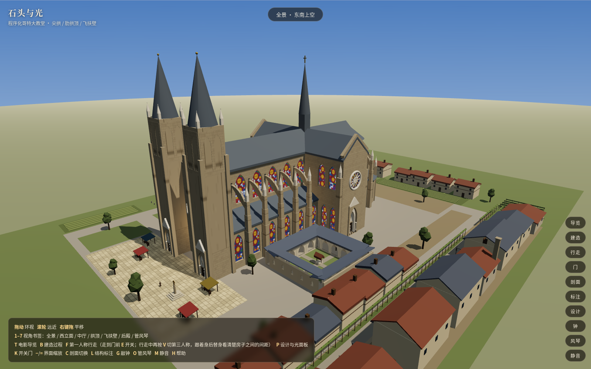

# 石头与光 · 程序化哥特大教堂

**在线体验：https://church.bigcow.net**（备用镜像：https://zhuguangjun2002.github.io/stone-and-light/）

用 Three.js 程序化生成的一座盛期哥特风格大教堂，可以在浏览器里自由漫游。
没有任何外部模型资源——每一块"石头"、每一尊像、每一张贴图，都是按真实大教堂的
结构逻辑用代码砌出来的。彩窗有两套镶玻方案；室内的间接光在加载时用 Worker 现烘成
顶点色；五座门能开能关（关 / 便门 / 全开），雨雪天会自己关上；第一人称走路会被墙、
柱、长椅和关着的门挡住。教堂不是孤零零的一座房子：它嵌在一片**领地**里——
南侧回廊、四周的教士住宅、北侧墓地和西端集市，同样全部由代码砌成。

> **EN** — *Stone & Light* is a fully procedural High Gothic cathedral in vanilla Three.js:
> pointed arches, quadripartite rib vaults, flying buttresses, procedural stained glass,
> a construction-sequence animation with medieval site equipment, a cinematic guided tour,
> day/night lighting, synthesized bells, baked vertex-colour interior light, working doors
> with wickets, weather, first-person collision, and parametric presets of Notre-Dame,
> Chartres, Amiens & Cologne. No external 3D assets — every stone is code.
> **Live demo:** https://church.bigcow.net



## 运行

```bash
cd church
python3 -m http.server 8123
# 打开 http://localhost:8123/
```

（任何静态文件服务器都可以；ES Module 不能直接用 file:// 打开。）

**排水演示页**：`tools/drainage.html`（本地 <http://localhost:8123/tools/drainage.html>）。
把回廊那套「屋面 → 内檐沟 → 落水管 → 明沟 → 暗管 → 渗井」的水路用动画水滴走一遁，
可切透视墙体看屋里的管子、按阶段飞相机；点「看一滴水走完全程」时一颗高亮水滴沿
整条路走一遍、镜头跟随、底部字幕报当前到哪一步。关键坐标来自 `src/town.js` 的
`drainageInfo()`（与真实模型同一份数据）。

**酿酒坊演示页**：`tools/brewery.html`（<http://localhost:8123/tools/brewery.html>）。
同一套玩法换到酿酒坊大院：六座酒坊的「屋面 → 檐沟 → 集水管 → 落水管 → 服务巷明沟 →
暗管 → 渗井」，顺便给六座建筑挂上名字标注。坐标来自 `brewInfo().drain`，与
`buildBreweryDrain()` 同源。

**人物自检页**：`tools/monk.html`（<http://localhost:8123/tools/monk.html>）。
把行走模式里那位第三人称替身站到一个铺石板的院落里，正/侧/背/全身/四分之三多角度
的机位，并可以切成 `assets/monk.glb`（Blender 无头脚本 `tools/generate_monk.py`
生成的同一款修士），两个版本都暴露出 `ArmL/ArmR/LegL/LegR` 枢轴节点——
页面按钮「播放走路动画」时：

- 程序化版 `src/person.js`：在 `requestAnimationFrame` 里用正弦驱动
  `rotation.x = sin(phase)·0.55`, ArmL+LegR 同相位、ArmR+LegL 相位差 π；
- Blender 版 `assets/monk.glb`：直接播它在 GLB 里保存的 4 条 walk clips
  （命名 `walk_ArmL/ArmR/LegL/LegR`），由 `THREE.AnimationMixer.update(dt)` 推进。

生成/导入命令：

    blender --background --python tools/generate_monk.py -- assets/monk.glb

`assets/monk.glb` 现在含 4 条动画片段 + pivot 几何；第一键把按钮切换成"暂停走路动画"。

## 操作

| 按键 | 功能 |
|---|---|
| 拖动 / 滚轮 / 右键拖 | 环视 / 远近 / 平移 |
| `1`–`7` | 视角书签：全景 / 西立面 / 中厅 / 拱顶 / 飞扶壁 / 后殿 / 管风琴楼廊 |
| `O` | 管风琴：西端楼廊上的琴（玫瑰窗之下、大门之上），奏巴赫《d 小调托卡塔与赋格》BWV 565 开头——公版乐谱、Web Audio 加法合成主音管音色，过教堂混响 |
| `T` | 电影导览：十个镜头约两分半的自动巡游，字幕解说，含剖面镜头与建造蒙太奇，黄昏收尾（`→` 跳下一镜头，`Esc` 退出） |
| `B` | 建造过程动画：按真实施工顺序自东向西、自下而上生长，时间轴可播放 / 拖动；脚手架与大车轮吊车跟随施工前沿，完工鸣钟 |
| `F` | 第一人称行走：点击画面锁定鼠标，WASD 移动，Shift 加速，再按 `F` 返回环视。**墙、柱、长椅、关着的门都挡人**（拿 `src/grid.js` 那张射线网格当碰撞体，腰、头各打一条射线；撞上就分轴各试一次，贴着墙会自然滑过去）。只开便门时，只有便门那 0.85 m 宽能挤过去 |
| `V` | 第三人称查看：在行走模式按 `V` 切到相机跟随一个真人大小（≈1.7 m）的替身，WASD 同样驱动替身走动、相机跟着从后上方看——用来检查院子与过道的尺度 |
| `P` | 设计与光面板：天气（晴 / 雨 / 雪，雨雪天自动关门）；门的小平面图；名堂预设（巴黎圣母院 / 沙特尔 / 亚眠 / 科隆，选中弹出年代、数据与故事的解说卡片）；时刻滑块（太阳自东向西，晨昏光色）；**镶玻方案**（沙特尔式 / 晚期银黄，换完自动重烘室内光照）；开间数 / 起拱高 / 尖拱曲率 / 塔高，改动即重建整座教堂 |
| `G` / `M` | 敲一记钟 / 静音（钟声为 Web Audio 非谐泛音合成；室外有风与鸟，入堂自动安静） |
| `K` | 开关门：五座门全开 ⇄ 全关。面板里的小平面图可以单独设每一座（关 → 便门 → 全开）；第一人称走到门前 4 m 内按 `E` 开关这一扇。开关都有木门吱呀声（关到位还有一记闷响），过教堂混响 |
| `C` | 剖面切换：完整 → 横剖 → 纵剖 |
| `L` | 结构标注：固定屏幕尺寸，随相机在室内 / 室外自动切换两组，屏幕上压盖的标签近处优先、自动避让 |
| `H` | 收起帮助 |

URL 参数：`?view=3&section=1&labels=1&build=0.42&time=0.95&panel=1&tour=1&preset=cologne`
`&weather=rain&doors=open&bake=0` 也可以（天气、门的状态、关掉光照烘焙）。

## 代码即结构：模块与建筑构件的对应

| 模块 | 建筑构件 | 结构原理 |
|---|---|---|
| `src/gothic.js` | 尖拱、束柱、山墙、小尖塔 | 尖拱可在同一高度适配任意跨度，是整套体系的几何自由度来源 |
| `src/vault.js` | 四分肋拱顶 | 蹼面取两个尖筒拱的相贯面 `y = max(纵拱, 横拱)`；不同跨度靠 `kForApex()` 调曲率拱到同一顶高 |
| `src/buttress.js` | 飞扶壁 = 扶壁墩 + 飞券 + 小尖塔 | 把拱顶的水平推力接力到侧廊之外，高墙才能开窗 |
| `src/glass.js` | 柳叶窗与玫瑰窗的彩色玻璃 | Canvas 程序化铅条镶嵌；两套镶玻方案（`GLAZING`）差在图案密度与**透光率**；不发光材质模拟"窗自体发光"的哥特室内观感 |
| `src/bake.js` / `src/grid.js` / `src/bakeworker.js` | 室内光照烘焙 | 静态的光离线算、运行时只查表——游戏里 lightmap 的做法（见下） |
| `src/doors.js` | 门的开关 | 三档状态（关 / 便门 / 全开）、枢轴缓动、能不能从这道门过去的判断 |
| `src/figure.js` | 门龛上的石像 | 一条剖面曲线沿竖轴放样成壳，周向压出竖直衣褶；每尊一个种子，没有两尊一样 |
| `src/facade.js` | 西立面：双塔、三门廊、玫瑰窗、国王廊 | 平面（中厅+双侧廊）直接投影为立面上的三座门；三座门都通到室内——塔身底层是可穿行的开间，侧门穿塔底进侧廊 |
| `src/cathedral.js` | 总装：拉丁十字平面、三段式立面、屋面 | 逐开间（bay）装配——中世纪工地也是这样一跨一跨盖的 |
| `src/town.js` | 教堂领地：回廊、教士住宅、墓地、西前庭集市、酿酒坊大院、院内地面分级 | 大教堂嵌在一片领地里（院墙已拆除）；领地不进建造动画（镇子先于教堂）、不进室内烘焙（室外靠天光），但进第一人称碰撞 |
| `src/materials.js` | 全部材质与程序化贴图 | 石缝、棋盘铺地、石板铺地、木门都用 Canvas 现画，无外部图片；贴图统一开各向异性过滤 |
| `src/params.js` | 全部尺寸 | 基础参数 + `recomputeDerived()`；设计面板改的就是这里 |
| `src/presets.js` | 名堂预设 | 用参数近似圣母院（平顶塔）、沙特尔（不对称塔）、亚眠（最高拱顶）、科隆（巨塔）——同一套结构语言，各城各唱各的调 |
| `src/tour.js` | 电影导览脚本 | 十个镜头的推轨路径与字幕，含剖面镜头、建造蒙太奇、黄昏尾声 |
| `src/worksite.js` | 工地装备 | 脚手架（LineSegments 格架）、大车轮踏轮吊车、石料堆，跟随建造前沿移动 |
| `src/audio.js` | 声音 | 钟声按真实钟的非谐泛音列（hum/prime/tierce…）合成；风、鸟、入堂圣咏垫，全部 Web Audio 无音频文件 |
| `src/main.js` | 光照日夜、漫游 / 行走、剖面、标注、建造动画、设计面板 | 建造次序 = 区域（歌坛→耳堂→中厅逐开间→西立面→尖塔）+ 区域内自下而上；剖面用材质级裁剪；标注按室内 / 外分组并做屏幕空间去重 |
| `src/person.js` | 第三人称替身 `buildPerson()`：长袍 / 披肩 / 兜帽 / 袖与里料 / 手腿 / 鞋 / 眼鼻须；四个枢轴组（ArmL/ArmR/LegL/LegR）存 `g.userData`，三.js/Blender两格中同名。 |

## 导览影片

[docs/tour.mp4](docs/tour.mp4) 是导览的成片（1280×720 / 24fps / 约 2 分 18 秒）。
重新渲染：页面以 `?record=1` 打开时进入确定性逐帧模式（`window.__tourStep(dt)`），
`tools/record-tour.mjs` 用 puppeteer 抓帧后由 ffmpeg 合成：

```bash
python3 -m http.server 8123 &
mkdir -p rec/frames && cd rec && npm i puppeteer-core
node ../tools/record-tour.mjs     # 默认走 GPU（headless=new + ANGLE→Vulkan），约 4 分钟
ffmpeg -framerate 24 -i frames/f%05d.jpg -c:v libx264 -pix_fmt yuv420p -crf 24 tour.mp4
```

抓帧脚本会先等 `window.__baked`（室内光照烘焙完成）再开始，否则片子中途明暗会变。
默认用 GPU：本机实测 NVIDIA MX230（`--use-angle=vulkan`）约 15 fps、整片 4 分钟；
而 SwiftShader 软件渲染只有约 1 fps、要一个多小时。无 GPU 或不稳时加 `--swiftshader` 回退。

> **码率要看着 Cloudflare Pages 来。** Pages 单文件上限 **25 MiB**，超了会整个部署失败。
> 当前导览片 crf 21 要 27 MB（被挡），**crf 24 约 23 MB**（刚进线）。改镜头/加细节后
> 重录，记得看一眼 `du -h tour.mp4` 别超 25 MiB。

## 测试与检查

六个检查器各查一类问题，当前基线（每次改几何都该重跑一遍）：

| 查什么 | 工具 | 当前 |
|---|---|---|
| 共面重叠（z-fighting） | `check-zfight.mjs` | 严格共面 ≥0.2 m² **0 处** |
| 画面抖动（真渲染微扰） | `check-flicker.mjs` | 完整外观 0.02–0.17%，剖面最高 0.31%，**无成片抖动**（合计 3507 px） |
| 下雨漏水 | `check-rain.mjs` | 垂直雨与八个风向 **0 处**（门开着时会照实报出来） |
| 构件穿出外皮 | `check-poke.mjs` | 49 个机位 **0 处** |
| 酿酒坊水路通不通 | `check-brew.mjs` | **7/7**（屋面雨可被收集并送走） |
| 阴影视锥罩得住吗 | `check-shadow.mjs` | 太阳走一天 **0 处**越界（7.3 cm/px） |

```bash
node test/smoke.mjs          # 无浏览器构建整个场景图，校验网格数与总高
node tools/check-zfight.mjs  # 静态查 z-fighting：共面重叠（见下）
node tools/check-flicker.mjs # 动态查闪烁：真渲染 + 微扰对比，能定位到具体网格（见下）
node tools/check-rain.mjs    # 下雨天哪里漏：撒一场雨，找出雨能钻进室内的口子（见下）
node tools/check-poke.mjs    # 查"露出来的部分"：构件的一角戳穿了屋面/墙面（见下）
node tools/check-brew.mjs    # 酿酒坊大院的水路连通：檐沟/落水管/明沟/暗管/渗井（见下）
node tools/check-shadow.mjs  # 阴影正交相机的视锥够不够罩住整片领地（见下）
node tools/check-flicker.mjs --swiftshader   # 退回软渲染，复现跨机器基线 3481 px（见下）
# test/audio-render.html     # 浏览器打开：离线渲染音频，测量钟声/管风琴的峰值与 RMS
```

> **渲染后端只留一份**（`tools/chrome-args.mjs`，`bakeshot`/`check-flicker`/`check-poke`/
> `shoot` 共用，抄一份就会漂）。**默认走本机显卡**（Chrome 报 ANGLE → NVIDIA Vulkan →
> **MX230**），与 `record-tour.mjs` 一致；没显卡或驱动不稳时 Chrome 自己回落软渲染，
> 整条链路不会因为拿不到 WebGL 而断。`check-flicker` 开头会自报一行"渲染后端"——
> 下面记的基线是哪块卡跑出来的，看它就知道。
>
> | 后端 | check-flicker 全扫 | 合计抖动 | 逐帧 1280×720（含 4096 阴影通道） |
> |---|---|---|---|
> | **MX230（默认）** | **5.3 s（4.6×）** | **3507 px** | 35 ms |
> | SwiftShader `--swiftshader` | 24.6 s | 3481 px | 45 ms |
> | Intel UHD 620（强制核显） | — | — | 56 ms（**比软渲还慢**，别选） |
>
> 两套后端 MX230 连跑三次都是 **3507**、软渲染至少两串都重合在 **3481**——数字是死支的，
> 差别只有 26 px；所以基线可以直接记，换机器或换驱动时加 `--swiftshader`（或 `CHROME_SW=1`）
> 就能复现跨机器一致的那一套。

### z-fighting 检查器

`tools/check-zfight.mjs` 在 node 里建出整座教堂，把全部三角形转成世界坐标后按支撑
平面分桶，找出**几乎共面 + 投影有重叠 + 法线同向**的面对——这类面深度值几乎相同，
谁被画出来由视角和浮点误差决定，走动时就会闪。用 Sutherland–Hodgman 裁剪算真实
重叠面积，再从重叠处朝法线半球打射线做可见性判定（先撞到背面 = 出发点在实体内部；
正对法线的射线走不出去 = 被挡住），把"埋在墙里所以不会闪"的那一大半滤掉。

```bash
node tools/check-zfight.mjs [最大间距m] [最小重叠m²]   # 默认 0.06 / 0.20
TOP=40 node tools/check-zfight.mjs 0.004 0.2           # 只看严格共面的，列前 40 条
```

当前基线：**严格共面（间距 ≤4 mm）、≥0.2 m² 的重叠 0 处**。0.2 m² 以下还有一条
长尾，是肋券交叉、墙体转角相接这类构件真实相交处的碎三角形，属于几何相交本身，
不做 CSG 消不掉。（放宽到默认的 6 cm 会报出两百多处，那些是按几何约定故意留出的
几厘米搭接量，不是打架。）

### 闪烁检查器（动态，会定位到具体网格）

静态检查器只认"共面重叠"这一种成因，管不了曲面相切、也管不了剖面。
`tools/check-flicker.mjs` 换一条路：用 headless Chrome（默认走本机显卡 MX230，没显卡会
自动回落软渲染；要复现可移植基线就加 `--swiftshader`，见本节开头）真渲染一帧，再渲染几帧**微扰帧**，逐像素比对——同一个像素两帧不一样，就说明
它的归属是靠浮点误差决定的，也就是屏幕上会闪的地方。三种微扰各自对应一种成因：

| 微扰 | 屏幕上动了什么 | 变了说明 |
|---|---|---|
| 近裁剪面 ×1.0002 | 什么都没动，只改深度量化 | **z-fighting**：两个面深度几乎相同 |
| 剖切面挪 4 mm | 什么都没动，只挪裁剪判据 | **面正好躺在剖切面上**：裁剪判据恒为 0，逐像素抖 |
| 相机挪 1 mm | 亚像素级移动 | 其余不稳定（透明体排序跳变等） |

抖动像素按格子聚成斑块，每个斑块再从那个像素打一条射线（射线也按剖切面过滤），
报出压在那儿的前几块网格：距离、几何类型、材质色、包围盒。同时输出一张标注图，
抖动像素涂红，可以直接跟截图对照。

```bash
node tools/check-flicker.mjs                                  # 6 个机位 × 3 档剖面全扫
node tools/check-flicker.mjs --views=3 --sections=1 --size=1280x800
node tools/check-flicker.mjs --pos=42,28,62 --tgt=0,12,34 --sections=2   # 复现某个截图的机位
node tools/check-flicker.mjs --pos=... --probe=255,345        # 只问：这个像素上压着什么
```

依赖 `npm i puppeteer-core` 与本机的 `/usr/bin/google-chrome`（可用 `CHROME=` 覆盖）。
取景页是 `tools/flicker.html`，光照、雾、地面、剖面、**阴影**都与 `main.js` 一致
（阴影用的是同一份 `P.shadow`，别在取景页里另抄一套）。

当前基线（18 个机位 × 800×500 全扫，默认 MX230）：完整外观下 **0.02%–0.17%**，两档剖面下最高
**0.31%**（横剖 + 中厅机位），合计抖动 **3507 px**；加 `--swiftshader` 重跑是
0.02%–0.18% / ≤**0.32%** / **3481 px**。剩下的都是柱身与附柱相切处的一条条细线（构件真实相交，
见上面那条长尾）——**没有成片的抖动**。

### 漏雨检查器（找"外面能看进来"的洞）

屋面是一片片薄板拼出来的，板与板之间只要差一点，外面就能看进阁楼——从某些角度
看过去是个三角形的洞，下雨天雨也从那儿灌进去。`tools/check-rain.mjs` 就照着这个
物理过程查：**按风向从天上撒一网格雨滴，看每滴最后落在哪。**

判据不是"撞到了什么材质"（那要给上千块网格挨个打标签），而是**落点的处境**，四条一起看：

- **落面朝上**：雨打在竖墙、玻璃上会顺着流走，只有朝上的面才存得住水；
- **头顶罩着**：正上方 + 一圈斜上方共 9 条射线，九成以上被挡住才算在屋面之下——
  不能要求全挡住（雨恰恰是从头顶那个口子进来的），也不能只看一条（飞券掠过也算挡）；
- **不是窄缝**：射线不到 1.2 m 就撞上，那是飞券与墙之间的缝，不是屋子；
- **天空可见度**：上半球二十条射线一条也跑不出去 = 封闭室内（**漏进室内**），
  还能漏出去几条 = 半开的夹层（**钻到屋面下**，单独一档报）。

漏点聚成团之后，再沿雨线从天上往落点二分，报出**雨是从哪个口子进来的**。

```bash
node tools/check-rain.mjs                          # 默认 0.6 m 一滴、风 0.35 从南
node tools/check-rain.mjs --step=0.5 --wind=0,0.7  # 风从西吹；洞窄时要把 step 调细
node tools/check-rain.mjs --wind=0,0               # 垂直雨：只查水平方向的洞
```

雨滴间距要比洞小，`--step=1` 会漏掉一米宽的缝；查得细就用 0.5（约 2 万滴、半分钟）。

`tools/rain.html` 是同一套判据的**下雨天模拟页**（判据代码 `tools/rainscan.js` 两边
共用）：调风向、风力、雨量，实时下雨；扫出来的漏点标红球加标签，红色的雨丝就是
漏进去的那些，点列表里的漏点可以飞过去看。开着本地服务器访问
`http://localhost:8123/tools/rain.html`（`#0.8` 这样的井号参数可以调雨滴间距）。

当前基线：**九个风向（垂直 + 八方，风力 0.5～0.7）扫下来，两档都是 0 处。**

判据是一路踩坑改出来的，两次差点漏判：只认"落点看不见天"时，**洞越大越查不出来**
（从口子底下抬头正好看得见那个口子）；只认"头顶全被挡住"时，漏进来的那滴恰恰头顶
是通的。现在的四条合起来才站得住。

### 排水通路正向校验（顺手查"水有没有被接住"）

上面只查"不该进的进来了"；同一个工具还反过来查另一半——**落在回廊屋面上的雨，
是不是真有一套东西接住、送走**。排水构件（檐沟 / 落水管 / 明沟 / 暗管 / 渗井）在
`src/town.js` 里打了 `userData.drain` 标签，`check-rain.mjs` 扫完漏点后顺带做七项
"水路连通"断言：

| 查什么 | 判据 |
|---|---|
| 屋面 → 内檐沟 | 四面檐口各取 6 点，正下方 1.2 m 内必须打到檐沟 |
| 檐沟 → 落水管 | 四根管顶的水平位置落在檐沟上（偏差 < 0.25 m）|
| 落水管 → 明沟 | 管底低于明沟面 |
| 明沟 → 暗管 | 暗管起点在明沟出口角（< 0.4 m）|
| 暗管 → 渗井 | 暗管终点通到渗井（< 0.2 m）|
| 渗井露天 | 井篦正上方 60 m 内无遮挡（水从这里离开系统）|
| 暗管埋地 | 管顶低于地面（看不见）|

任一项不过就 `exit 1`。当前基线 **7/7 通过**；故意把暗管抬到地面上，会立刻报
`✗ 暗管埋在地下`。`--no-drain` 可只跑漏点扫描。

### 酿酒坊水路正向校验

酿酒坊大院是同一套思路的第二份实现，但**独立成一个工具**：`tools/check-brew.mjs`
（不撒雨、秒级，只问"通不通"）。构件在 `buildBreweryDrain()` 里打 `userData.brew` 标签
（`roof`/`gutter`/`spout`/`channel`/`culvert`/`soak`），关键几何由 `brewInfo().drain`
回传——演示页 `tools/brewery.html` 拿的也是同一份数据，改一处两边一起变。

水路是：**屋面 → 檐沟（贴服务巷一面）→ 集水管（六座进深不一样、檐口深浅不一，
统一找齐到 x=61.86）→ 落水管 → 服务巷东缘明沟（通长 116 m）→ 东端出口暗管 → 渗井**。

前两项用射线查：每座建筑沿檐口取 5 点，正下方 0.4 m 内要打到檐沟、正上方 0.3 m 内要
打到屋面（当前 30/30 + 30/30）；后面五项与回廊那套同构（管顶落在沟上、管底落进沟、
暗管起点在出口、终点通渗井、渗井露天、暗管埋地）。任一项不过就 `exit 1`，
当前基线 **7/7 通过**。

### 阴影视锥检查器（"影子到此为止"）

日光的阴影是一台**正交相机**（`src/main.js` 的 `sun.shadow.camera`，参数收在
`src/params.js` 的 `P.shadow`，太阳轨迹是同一个文件里的 `sunPos(t)`）：它照不到的地方
不是"暗一点"，而是**整块网格的影子被丢掉**——地面上会留下一道硬边界，一眼就看得出
画面坏了。领地一扩（墙推远）最容易撞上这个：扩建把视空间需求从约 ±95 抬到 ±150，
旧的 ±110 已经压线，全天有 133 处投影越界。

`tools/check-shadow.mjs` 拿太阳轨迹走一天 48 档，把每块投影/接影网格的角点投进视空间，
和 `P.shadow` 的范围比；静态、无浏览器、几秒跑完。当前基线 **0 处越界**，
需求 x ±150 / y ±110，贴图 4096 → 7.3 cm/px（比原来 2048 配 ±110 的 10.7 cm/px 还细，
覆盖反而更全）。改领地范围、太阳轨迹、`P.shadow` 任一处都要重跑。

### 穿刺检查器（"露出来的部分"）

`tools/check-poke.mjs`：构件的一角戳穿屋面、墙面时，在大片外皮当中会留下一个孤零零
的小色块。查法是把每块网格涂成**编号色**渲染一遍（ID 图，`tools/poke.html`），找出
**被同一块大面包围的小岛**，再打两条射线比深度——小岛与外皮几乎等距（<6 cm）说明
真的插在里面；差得远只是前面挡着的构件。三条闸门治误报：玻璃嵌在洞里不算；小岛在
外皮**后面**（凹进去的）不算；这块网格在别处也大片露着（贴面的装饰板）不算。

```bash
node tools/check-poke.mjs                      # 两个半径 × 三个仰角 × 八个方位 + 正俯视
node tools/check-poke.mjs --r=70 --size=1200x840 --gap=0.06
```

当前基线：**49 个机位扫下来，0 处穿刺。**（领地是独立个体，墓碑、窗这类"站在面上"的构件会被判成外皮孤岛，所以穿刺检查器按 `userData.town` 跳过领地，只查教堂外壳。）

### 门

五座门（西立面三座 + 南北耳堂各一座）都是**真的门**，不是贴在洞口上的一块板：

- **过梁 + 门楣 + 中柱**。真教堂的门远比门洞矮——门扇顶上横一道过梁，过梁以上的
  尖拱面是实心的门楣浮雕。中门净宽 3.8 m、门扇高 4.6 m（原来是一整片 6×13.65 m
  的板，比管风琴楼廊底面还高 5 m，向内开会直接撞进楼廊）。
- **两扇门板**，各带厚度、三道铁铰链带、门钉、门环；门轴朝室内（门龛层层内收，
  向外开会撞门龛）。
- **便门（wicket）**：中门与南耳堂门的左扇上挖一扇小门。巨门要几个人合力才推得开，
  日常都从这扇小门进出，大扇只在庆典、出殡时才开——所以门有**三档**：
  关 / 便门 / 全开，没有便门的门只有两档。
- **门颊不用另做**：最内一圈门龛的墙体本身就是门颊，再补一块反而与它面对面共面。
- **门板的做法照着实物来**：竖向拼板 + 背面横三道**撑条（ledge）**把板钉在一起；
  正面是铁**铰链带（strap）**，钉子跟着撑条那几行排（不是满门乱撒），从正面打进、
  背面敲弯钉牢；铰链带套在门框里的 **L 形销轴（pintle）** 上——转轴在门框，不在门板。
  门**向内开**：这是中世纪教堂门的常规做法。门环是拉门的把手（达勒姆主教座堂那只
  "庇护门环"是狮首衔环的门锤、挂在北门上，属于个例，没照搬）。
- **门龛上的人像**（按《最后的审判》的标准构图）：门楣正中基督坐在杏仁形的
  **曼多拉**里、两侧天使托举，最下面紧贴过梁的一带最小，是复活的死者；**中柱**上
  立一尊带头光的像（亚眠是"美丽的上帝"）；门龛侧壁一层一对**柱像**，脚下托座、
  头上华盖，越往里越小。人像是几个基本体拼的（锥台身子 + 收肩 + 球头 + 贴身双臂），
  这个工程不引外部模型，人像也只能这么长出来——远看轮廓对就够了。
- 门扇装在各自的枢轴组里（`src/doors.js`），`K` 键全开全关，面板里的小平面图
  点哪座切哪座。

**天气**（晴 / 雨 / 雪）改的不只是天色、雾和日照：**雨雪天五座门自动全关**——真教堂
就是这么干的，"礼拜开始后就得关门"在多雨多风的地方是常规操作。雨雪粒子在进堂之后
自动隐藏（屋顶底下当然看不见雨）。

门和漏雨检查器是连着的：

```bash
node tools/check-rain.mjs --wind=0,-0.8 --doors=closed   # 漏点 0
node tools/check-rain.mjs --wind=0,-0.8 --doors=open     # 落进室内 14 滴 = 2.2 m²
                                                          # 按 20 mm/h 算 ≈ 45 升/小时
```

西风斜雨、大门全开时，雨会灌到门内 2.6 m 的中厅铺地上——这就是为什么真教堂下雨天
关门。

门的资料出处：[Early and Vernacular Timber Doors](https://www.buildingconservation.com/articles/early-timber-doors/early-timber-doors.htm)、
[Early and Vernacular Door Fittings](https://www.buildingconservation.com/articles/doors/door_furniture.htm)、
[Hinges and pivots in the Middle Ages](https://ebrary.net/281214/environment/hinges_pivots_middle_ages)、
[Sanctuary knocker](https://en.wikipedia.org/wiki/Sanctuary_knocker)、
[Wicket Doors](https://idighardware.com/2011/01/wicket-doors/)、
[Church porch](https://en.wikipedia.org/wiki/Church_porch)、
[Trumeau](https://en.wikipedia.org/wiki/Trumeau_(architecture))。

### 教堂领地（close）

大教堂从来不是孤零零的一座房子。中世纪教堂嵌在一片"领地"里：南侧回廊是
修士的日常动线，四周是教士住宅与墓地，西端前庭是集市。`src/town.js` 把这些也全部
程序化砌出来：

- **院墙已拆除**：本场景扩建期间一度立起**双圈围墙**——外圈南 76 / 北 −64 / 西 78 /
  东 −78 m，旧围墙降为院内的**庭墙**，西正门是一整座带尖拱门洞楼体、覆双坡石板顶、
  四角小尖塔。2026-10 按用户要求把这两圈**全拆了**：领地广场、服务巷、酿酒坊大院、
  回廊这些布局原样保留，只是四周再没有围墙、门楼和角塔了。
- **回廊**（南侧、中厅与耳堂之间）：四面敞廊围出内院，朝内院是一排尖拱、外侧实墙开
  小窗、单坡石板顶。屋面外高内低（披屋靠着外侧更高的建筑），檐口自然落在内院一侧；
  沿内檐一圈**铅皮檐沟**把水收住，再由四角**落水管**引到院角，院子里再绕一圈
  **石砧排水明沟**把四个角连成一套；四角的水汇到东南角，经一根**暗管**（涵洞）穿过
  东翼地面，排入院外过道里的**渗井**（井篦在地面，水渗入地下）——雨不会直接泻到
  草地上。想看清这条路就用 `tools/drainage.html`。内院铺草地、十字路径，
  中央一口水井。回廊外缘取 x = 18.5 m，
  与南侧飞扶壁的扶壁墩（最远伸到 x ≈ 15.9）之间留出 **约 2.6 m 的过道**——让 22 m 高
  的扶壁墩完整露出来。内院取 16 m 见方，东缘落在 x = 42.9，与南墙那排住宅前脸
  （x ≈ 45.4）之间也留出 **约 2.5 m**：回廊东西两侧的过道差不多宽，走起来不再挤。
- **教士住宅**：沿南墙、东墙各排一列，抹灰墙 + 木构架 + 双坡瓦顶 + 烟囱。
  东排外移到新东墙（`EAST_HOUSE_X`，x≈0 处留出 6.8 m 的殡门通道）。
- **酿酒坊大院**（新扩的南 / 东 / 北三边里）：六座生产建筑从东到西排成一条生产流——
  粮仓（带吊装口）→ 烘干窑（带烟囱）→ 麦芽楼 → 煮酒房 → 冷却·发酵 → 酒窖酒肆；
  前面一条**服务巷**（旧南墙与酒坊之间），巷东缘是**排水明沟**，院坝一口水井、四只酒桶、
  酒花架与菜园药圃。屋面雨水的去向见上文「酿酒坊水路正向校验」，演示页 `tools/brewery.html`。
  背景调研（修道院与教堂的区别、Weihenstephan / Trappist 史实）见 `docs/brewery-research.md`。
- **墓地**：北侧一块草坪，成排的立碑与十字，几棵紫杉。
- **西前庭集市**：市场十字、四处摊棚；正门到西立面之间是整片石板前庭。
- **院内地面分级**：原来一整块灰广场被拆成 前庭石板 / 北侧草地 / 后殿东侧与南侧的
  压实土 几档（另有北侧一条步道），各叠 2–6 cm 的薄平面避免共面——领地内部不再是
  一张灰板。西前庭那片石板不再是纯色，改由 `pavingTexture()` 程序画出错缝石板
  （`src/materials.js`），UV 按世界坐标铺、一张 6 m 见方，所以 58×24 m 的前庭与
  2×42 m 的步道上石板缝一样大、相邻区块还对得上；后殿东侧那片压实土铺满整个东端
  （x −31…41），不在墙根留一圈灰广场。

接入方式是"挂进 `buildCathedral()` 的 `root`"：于是领地自动进入第一人称碰撞、参数重建
与资源释放。但领地材质标了 `userData.noBake`（室外靠天光/日照，不进室内顶点色烘焙）、
网格标了 `userData.buildSkip`（镇子先于教堂存在，不进建造动画），穿刺检查器也按
`userData.town` 跳过领地。烘焙版本号因此从 v1 提到 v2——回廊与住宅现在作为遮挡与
反弹面参与烘焙。

又一个共面的坑（与教堂那些是同一类）：领地草坪停在耳堂地坪之外、回廊端墙比侧翼短几厘米、
墙头压顶石贴墙顶（两者法线相反）、院内地面分级各档错开 2–6 cm——都是为了避免"两个朝向
相同的面落在同一平面上"，否则 `check-zfight.mjs` 会照实报出来。

### 室内光照烘焙

真彩窗是半透明的滤光片，光穿过去会把石头染上颜色；而实时渲染里这类间接光是算不起的。
所以照游戏的老办法来：**静态的光离线算完、运行时只查表**。

`src/bake.js` 对每个顶点朝法线半球撒 32 条射线，看它们各自撞到什么：

- 跑出去了 → 天光（贡献 1.0，所以露天的面烘出来是白的，外观不变）；
- 撞到彩窗 → 窗色 × 透光率 × 增益（窗比天空亮得多）→ **石头被窗子染色**；
- 撞到别的石头 → 那块材质的固有色 × 0.45，当一次弹射。

太阳不参与烘焙——时刻滑块要能实时变；烘的是天光、窗光、弹射这三样不随时间变的。
结果写进 geometry 的 `color` 属性，材质开 `vertexColors`，运行时零成本。

页面加载后由 `src/bakeworker.js` 在几个 Worker 里算：每个 Worker **自己按同一套参数
再建一遍教堂**（`buildCathedral()` 是确定性的，Worker 里没有 document，贴图退成平色，
但几何与遍历顺序和主线程完全一致），只烘 `index % n === k` 的那些网格，结果按下标拼
回来，再按参数指纹存进 IndexedDB——换回原来的方案时直接贴上去。`?bake=0` 可以关掉。

**三个坑**，都踩过：

- 几何体是多处共用的（同一开间的墙复用一份），不逐网格克隆的话一处的结果会串到别处；
- 材质也是共用的，开 `vertexColors` 之前必须保证**每一块**用到该材质的网格都有 `color`
  属性——缺了着色器拿不到属性，那块网格直接变黑；
- 烘焙一旦生效，室内那三盏"替身点光"就得调暗（220 → 110），否则会把烘出来的层次冲平。

手机与小内存设备走**低精度档**：射线 32→14、顶点缓存 0.25→0.45 m、射线网格 1.2→1.6 m、
Worker 只开 2 个。实测低精度档比全精度快 **1.9 倍**（22.6 s vs 43.5 s，单线程），而画面
差**最大 8/255、平均 0.06**——基本看不出来。判断"小设备"不能只看 `navigator.deviceMemory`：
iOS 的 Safari 根本不支持它，取不到值时不能当成大内存机器，所以屏宽、核数、指针类型
三样一起判。烘完存 IndexedDB，同一台机器只付一次。

速度（本机 8 线程、软件渲染下实测）：

| | 顶点 | 用时 |
|---|---|---|
| 单线程、无优化 | 21 万 | 32 分钟 ❌ |
| + `src/grid.js` 射线加速网格 | 21 万 | 62 s |
| + 同位置顶点缓存（0.25 m 量化） | 10.2 万（实算） | 27 s |
| 页面里 4 个 Worker 并行 | — | **约 40 s**（主线程还在软渲抢 CPU；有独显时会明显更快） |

`src/grid.js` 是那个把烘焙从"半小时"拉回"半分钟"的东西：原来逐网格试包围盒（1200
多次/条射线）再整块试三角形，室内发散的射线几乎穿到每一块的包围盒，只能跑 1800
条/秒；改成把 17 万个世界坐标三角形装进 1.2 m 的均匀网格（CSR 存储）、射线走 3D DDA，
**14.7 万条/秒**。与 three.js 原生射线对拍 300/300 一致（材质都设成双面之后——网格
是双面求交，遮挡判断本来就该这样）。顶点缓存那一档的画面差是**最大 3/255、平均
0.001**，等于白捡一倍速度。

`tools/bakeshot.html` + `tools/bakeshot.mjs` 是烘焙前后的 A/B 对照取景页（两套玻璃 ×
两个机位 × 烘焙前后共八张）。

### 加新构件时的几何约定

这几条是踩过坑之后定下来的，新加东西时照着做能省掉一轮排查：

- **不要让两片朝向相同的面落在同一平面上。** 构件相接时让一方嵌进另一方几厘米
  （券脚插进墙、屋面出挑、附柱比柱心高一点），不要做到"正好齐平"。
- **铺地一律用 `worldFloorUV()` 按世界坐标铺 UV**，不要用几何体归一化的 UV——
  后者会让不同尺寸的地坪上格子被拉成条纹，块与块之间也对不上缝。
- **大地/广场/地坪/草地都保持单面朝上，地下另铺一层法线朝下的"泥土"面片。** 单面
  朝上的平面从下方看会被背面剔除，露出的就是下面那层土色面片——比开双面真实得多
  （双面的话背面无光，从地下看是一整片黑幕）。泥土用 `MeshBasicMaterial`（不受光照、
  恒亮）配一张程序化土壤纹理：噪声 + 岩层，避免一眼看成纯色。着地的墙/柱再往下延
  一段地基（`main.js` 的 `addFoundations`，挂在 scene 不挂 root，因此不进碰撞/烘焙/
  建造动画，也不被六个检查器看见），土面定在 -2.5、地基从 -0.02 埋到 -3.0——从地下
  看墙脚是真的戳进土里，而不是悬空。
- **墙体洞口底边会生成一片 y=0 的水平面。** 层叠的几道墙各生成一片、彼此共面，
  所以门口要用一块实心门槛把它们压在下面。
- **剖切面不要落在构件自己的平面上。** 墙体是逐开间挤出的，接缝处两侧各有一片端面；
  剖切面正好压在接缝（或玫瑰窗光柱所在的 x=0）上时，裁剪判据恒等于 0，每个像素的
  生死由浮点误差决定，整片面就抖成麻点。`main.js` 的 `CUT_EPS` 把剖切面往保留的一侧
  偏 5 cm：画面内容不变，抖动消失。
- **多边形屋面要盖得住多边形墙的「角」。** 半锥屋面按外接圆给半径，可它渲染出来是
  12 边形，平面处比外接圆矮 `cos(π/12)`；下面的墙也是折线，转角处比墙面还远
  `sqrt(外皮² + 半面宽²)`。两头一夹，"半径比墙大一点"根本不够——墙角就从屋面里
  戳出来，远看是屋面上一片小尖角。
- **骑在曲面上的小构件要「跨」着曲面放**（下端埋进去、上端露出来），别按另一条
  直线插值算上端——一插值就整根缩进曲面里，只从面上戳出几厘米。
- **屋面是 0.7 m 厚的薄板，交接处必须真的叠上。** 十字屋面要成为一顶不漏的帐篷，
  靠的是中厅、歌坛、耳堂三片薄板在交叉部真正交叠；哪片少盖了一段，四个角上就
  缺一块，外面能一眼看进阁楼。后殿半锥与歌坛屋面同理，切面要往里搭 0.6 m，
  端面对端面地"刚好接上"会留一道贯通的缝。
- **光柱、光斑这类大面片要按「两点」摆，别按角度凑。** 它们不写深度，穿墙了不会
  被挡住，只会变成一片浮在空中的亮矩形；按「窗口端 → 地面端」两点定长度和倾角，
  再检查四角还在不在这个空间里（矩形转过角度之后，角比中线伸得远）。
- **贴图走 `canvasTexture()`**，它已经统一设好各向异性过滤与 mipmap；掠射角下
  地面的摩尔纹就是靠这个压住的。
- `buildCathedral()` 末尾有一道**完全重合网格去重**（同几何 + 同材质 + 同位置），
  相邻开间共用的横向券这类重复画两遍的情况会被自动删掉一份。

### 无头截图

`tools/shot.html` 是取景页：与 `main.js` 同一套光照和地面，但相机由脚本指定，
用 puppeteer 调 `window.__shot(px,py,pz, tx,ty,tz)` 与 `window.__sunAt(t)` 出图，
适合定点比对某处改动。`docs/` 里的截图直接用 URL 参数拍主站（`?view=1`…`?view=6`），
**等烘焙跑完再拍**——第一张付一次烘焙的钱，后面几张走 IndexedDB 缓存。

## 部署

**push 到 main，Cloudflare Pages 自己上线**（项目 `church`，Git 集成，
无构建步骤、直接发布仓库根目录，`_headers` 会被自动识别）。
绑定 <https://church.bigcow.net>，回滚在 Cloudflare 面板点 Rollback。

**部署有个坑：单文件上限 25 MiB。** 任一文件超了，**整个部署会失败**（连别的小文件
也不更新，线上还是旧版）。二进制就 `docs/tour.mp4` 一个，用 crf 24 约 23 MB 刚好进线；
重录片子后记得 `du -h docs/tour.mp4` 看一眼。

2026-09-10 之前是两条路并行，都已废止：

- **GitHub Pages 镜像已关闭**。它每次 push 触发 GitHub 内置的
  `pages build and deploy`，一个月吃掉 85 分钟 Actions 额度，而发布的内容与
  主站完全重复（这个项目是单文件静态站，根目录就是成品）。
- **`tools/deploy-cf.sh` 手动直传不再需要**，项目已从 direct upload 改成 Git 集成。
  脚本留着当应急手段，但正常情况下不要用——直传会绕过 git 历史。
